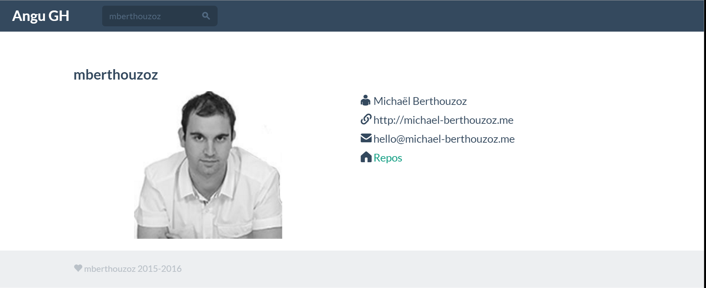
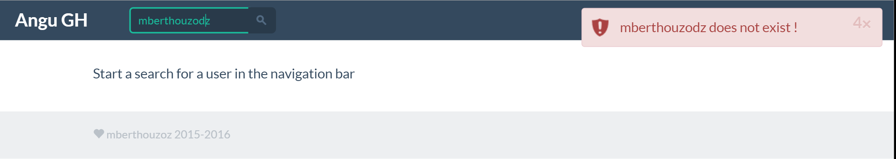
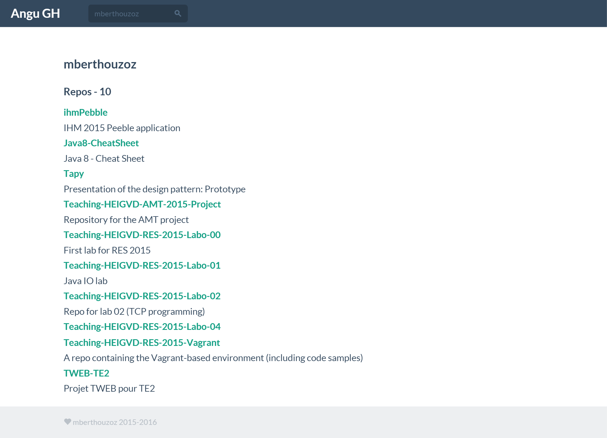
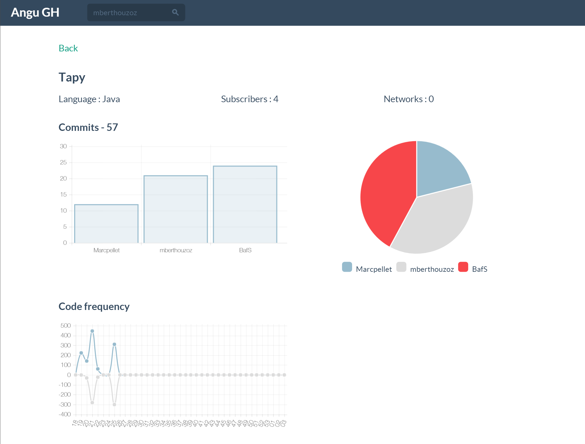
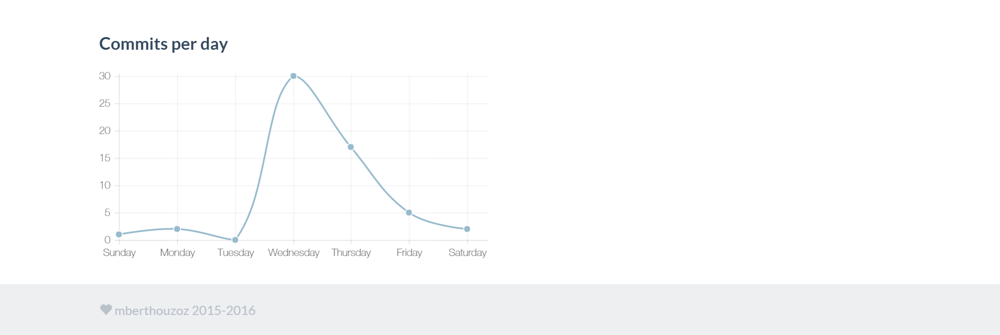

# TWEB TE 2

## But
Le but de ce projet est de fournir des données via l'API de GitHub. 

Les fonctionnalités choisies sont :

- Récupération des informations d'un utilisateur
- Récupération des dépôts publics d'un utilisateur
- Récupération des statistiques concernant un dépôt d'un utilisateur

## Yeoman

Pour la génération de la strucutre Yeoman a été utilisé.

[yeoman/generator-angular](https://github.com/yeoman/generator-angular)

Il faut au préalable installer `yo`, `grunt-cli`, `bower`, `generator-angular` et `generator-karma`

`npm install -g grunt-cli bower yo generator-karma generator-angular`

Pour créer l'application : 

`yo angular anguGH`

## Librairies

### Chart.js
C'est une librairie qui permet de générer des graphiques.

Il y a un module angular *angular-chart.js*

`bower install angular-chart.js --save`

### Growl V2
C'est une librairie qui permet d'afficher des notifications.

Il y a un module angular *angular-growl-v2*

`bower install angular-growl-v2 --save`

### angular-loading-bar
C'est une librairie qui permet d'afficher une barre de chargement lors de requête HTTP.

Le module angular est *angular-loading-bar*

`bower install angular-loading-bar --save`

## Structure

- app
  - scripts
  		- controllers
	      	- navbar.js
	      	- repos.js
      		- stats.js
    	  	- user.js
    	- services
    	  - angugh.js
    	  - repos.js
    	  - stats.js
    	  - user.js
    	- app.js
  - styles
	  - main.css
  - views
	  - repo.html
	  - repos.html
	  - stats.html
	  - user.html
  - 404.html
  - index.html
- bower.js
- Gruntfile.js
- package.json
- Procfile
- web.js

Il y a 4 contrôleurs :

 - NavbarCtrl: qui gère le barre de naviguation qui contient un champs de recherche
 - ReposCtrl : qui va chercher le(s) dépôt(s) et le(s) retoune à la vue
 - StatsCtrl : qui va chercher les statistiques et les retourne à la vue
 - UserCtrl  : qui va chercher les informations concernant à un utilisateur et les retourne à la vue

Il y a 5 services :

- APIConfig (constant) : contient la constante de l'URL de l'API GitHub
- Repos (factory) : retourne une *$resource* qui effectue les requêtes sur les dépôts
- Stats (factory) :retourne une *$resource* qui effectue les requêtes sur les statistiques (punchCards)
- Contributors (factory) : retourne un *$http* qui effectue une requête GET sur les statistiques (contributors)
- Users  (factory) : retourne une *$resource* qui effectue les requêtes sur les utilisateurs

## Heroku

Pour le déploiement sur Heroku, il a fallu créer un fichier *Procfile* qui contient `web: node web.js` qui précise que c'est un application web et qui doit exécuter la commande `node`sur le fichier *web.js*.

Il a fallu créer le fichier *web.js* qui est un application Node.js. Heroku ne gère pas les applications *AngularJS*, il faut donc faire passer notre application pour une application Node.js. 

Une modification du *Gruntfile.js* fut nécessaire.
- Ajout d'une nouvelle tâche pour Heroku : heroku:production
	- Effectue `bower install`
	- Build le projet

Le site : [https://tweb-te2.herokuapp.com/](https://tweb-te2.herokuapp.com/)

## Build & developpement

Exécuter `grunt` pour build et `grunt serve` pour prévualiser.

## Résultat

### Barre de recherche

Depuis n'importe quelle page, l'accès à la recherche d'un utilisateur est disponible.

### Information d'un utilisateur

La présentation d'un utilisateur.

### Utilisateur inconnu

Si un utilisateur n'existe pas, une notification apparaît.

### La liste des dépôts

La liste des dépôts publics d'un utilisateur.

### Statistique du dépôt

Les statistiques concernant un dépôt.

